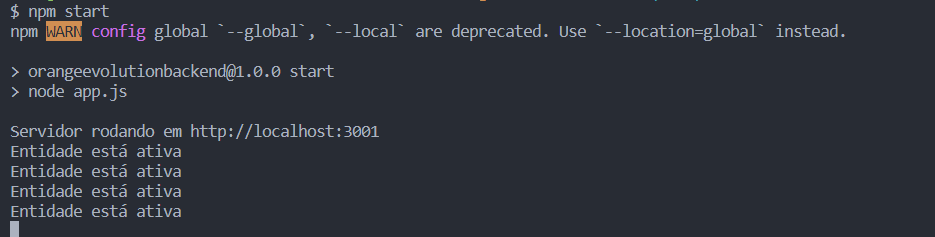
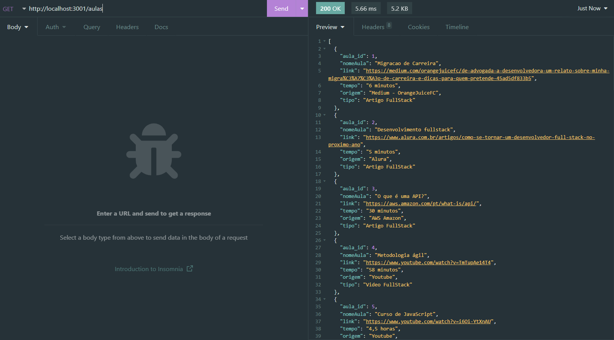
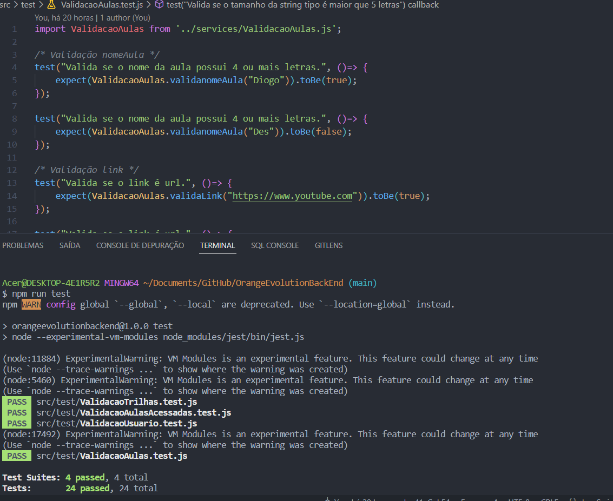

# 

   

 # Orange Evolution
 
 # Índice
 * [Logo do projeto](#Logo-Evolution)
 * [API Rest](#API-REST)
 * [Começando](#🚀-Começando)
 * [Pré-requisitos](#📋-Pré-requisitos)
 * [Instalação](#🔧-Instalação)
 * [Instalação da ferramenta Insomnia (utilizada para testar as rotas da API)](#Instalação-da-ferramenta-Insomnia-(utilizada-para-testar-as-rotas-da-API))
 * [Executando a aplicação](#⚙️-Executando-a-aplicação)
 * [Entidade Usuários](#Entidade-Usuários)
 * [Entidade Trilhas](#Entidade-Trilhas)
 * [Entidade Aulas](#Entidade-Aulas)
 * [Entidade AulasAcessadas e métodos](#Entidade-AulasAcessadas)
 * [Testes unitários](#Testes-unitários)
 * [Construído com as seguintes ferramentas](#🛠️Construído-com-as-seguintes-ferramentas)
 * [Autores](#Autores)
 * [Licença](#📄Licença)
 

## API REST

Projeto do Programa de Formação do Grupo FCâmara Season 4. 
A proposta do projeto é a criação de um MVP dado a problemática enviada em processo de hackaton. O seguinte repositório apresenta a construção do banco de dados
para a construção da página Orange Evolution. A aplicação (API) executa todas as ações do CRUD (Create, Read, Update, Delete) utilizando o padrão REST dos verbos HTTP. A aplicação foi desenvolvida em Node.js juntamente com Express e jest.

## Links do Projeto:
https://orangevolution.herokuapp.com/aulas

https://orangevolution.herokuapp.com/aulasAcessadas

https://orangevolution.herokuapp.com/usuarios

https://orangevolution.herokuapp.com/trilhas


## 🚀 Começando

Essas instruções permitirão que você obtenha uma cópia do projeto em operação na sua máquina local para consumir a API.

Consulte **Executando a aplicação** para saber como utilizar o projeto.

### 📋 Pré-requisitos

O que você precisa para instalar o software e como instalá-lo?

```
Node.js (Recomendamos procurar e instalar a versão LTS)
```

### 🔧 Instalação

Uma série de exemplos passo-a-passo que informam o que você deve executar para ter um ambiente de desenvolvimento em execução.

**Instalação do Node:**


***Windows:***


Você pode baixar direto pelo site: [node](https://nodejs.org/en/)

Ou então via Chocolatey:
```
choco install nodejs-lts
```

***Mac:***

Você pode baixar direto pelo site: [node](https://nodejs.org/en/)

***Linux*** 

via apt e snap:

```
sudo apt-get install curl

curl -fsSL https://deb.nodesource.com/setup_lts.x | sudo -E bash -

sudo apt-get install -y nodejs
```

Após a instalação do Node utilizaremos os comandos do NPM (Node Package Manager) no terminal para instalar as bibliotecas usadas no projeto (axios, cors, dotenv, express, jest, node-fetch, path, sqlite3, sudo e url):

```
npm install
```
Após a instalação você ele deve ter baixado uma pasta chamada node_modules conforme abaixo:


#### Instalação da ferramenta Insomnia (utilizada para testar as rotas da API):

***Windows:***

Você pode baixar pelo site: [Insomnia](https://insomnia.rest/download)

ou então via Chocolatey
```
choco install insomnia-rest-api-client
```
***Mac:***

via brew:
```
brew install --cask insomnia
```

***Linux:***

via snap:
```
snap install insomnia
```


## ⚙️ Executando a aplicação


Para executar o teste você deve inserir o comando start do npm:

```
npm start
```
então irá aparecer no terminal a mennsagem que o servidor está rodando com o link para acesso das rotas. 



No Insomnia, é possível acessar e modificar o banco como queira, utilizando os métodos GET, POST, PUT e DELETE.
Exemplo de método GET:




Para acessar alguma das entidades deve-se acessar a rota correspondente (ex.: para acessar a entidade aulas, coloque o complemento "/aulas" ao final do link: http://localhost:3001/aulas) e passar um objeto JSON conforme abaixo:

**ATENÇÃO: Não se esqueça da vírgula entre um atributo e outro. O último atributo não deve conter vírgula.**
Exemplo de como devem ser executados os comandos para adicionar um novo ou editar um existente: 

### Entidade Usuarios: 

Acessar pela rota: http://localhost:3001/usuarios

Modelo do corpo da requisição: 
``` 
    Exemplo:
    {
		  "usuario": "Luan Laranja",
		  "senha": "luan123",
		  "isAdmin": 0
    }

```

### Entidade Trilhas: 

Acessar pela rota: http://localhost:3001/trilhas

Modelo do corpo da requisição: 
``` 
    Exemplo:
    {
        "nomeTrilha": "Trilha Fullstack",
		    "tipo": "Artigo FullStack"
    }

```
### Entidade Aulas: 

Acessar pela rota: http://localhost:3001/aulas

Modelo do corpo da requisição: 
``` 
    Exemplo:
    {
        	"nomeAula": "Migracao de Carreira",
		      "link": "https://medium.com/orangejuicefc/de-advogada-a-desenvolvedora-um-relato-sobre-minha-migra%C3%A7%C3%A3o-de-carreira-e-dicas-para-quem-pretende-     45ad5df833b5",
		      "tempo": "6 minutos",
		      "origem": "Medium - OrangeJuiceFC",
		      "tipo": "Artigo FullStack"
    }

```
### Entidade AulasAcessadas: 

Acessar pela rota: http://localhost:3001/aulasAcessadas

Modelo do corpo da requisição: 
Obs: Em aulas acessadas é necessário incluir o id do usuário e o id da aula, para unir as duas entidades criando uma conexão entre o usuário e a aula escolhida.
``` 
    Exemplo:
    {
      		"nomeAula": "Desenvolvimento fullstack",
		      "tipo": "Artigo FullStack",
		      "usuario_id": 1,
		      "aula_id": 2
    }

```

Depois acesse a rota e escolha o método para cada uma das ações do CRUD

**Método GET**

O método GET pode ser utilizado de duas maneiras:

1. Selecionar todas as informações do banco. Para isso utilize o método GET na rota da entidade escolhida.
Ex.: http://localhost:3001/trilhas

2. Selecionar apenas uma informação filtrada pelo ID. Para isso complemente o link da rota com "/id".
Ex.: http://localhost:3001/trilhas/1


**Método POST**

No método POST você deve preencher o corpo da requisição conforme descrito acima e utilizar a rota na entidade escolhida.
Ex.: http://localhost:3001/trilhas

Se as informações passadas no corpo da requisição passarem na validação ele irá criar um novo item dentro da entidade escolhida com um id único, gerado automáticamente.


**Método PUT**

No método PUT você deve preencher o corpo da requisição conforme descrito acima e utilizar a rota na entidade escolhida complementando com "/id".

Ex.: http://localhost:3001/trilhas/1

Se as informações passadas no corpo da requisição passarem na validação ele irá alterar o item dentro da entidade escolhida com o id único passado na rota.


**Método DELETE**

No método DELETE você deve utilizar a rota na entidade escolhida complementando com "/id".

Ex.: http://localhost:3001/trilhas/1

Ele irá deletar o item dentro da entidade escolhida com o id único passado na rota.


## Testes Unitários :test_tube:

O programa também possui uma pasta de arquivos de validação, onde existem termos específicos para cada atributo das entidades que para adicionar um novo ou alterar um existente, precisam passar por essa validação:
```
Exemplo:
test("Valida se o link é url.", ()=> {
    expect(ValidacaoAulas.validaLink("https://www.youtube.com")).toBe(true);    --- Espera-se que o resultado seja true;
});

test("Valida se o link é url.", ()=> {
    expect(ValidacaoAulas.validaLink("linkQueNaoPareceURL")).toBe(false);	--- Espera-se que o resultado seja false;
});
```

Para rodar os testes unitários, é necessário usar o seguinte comando no terminal:
```
npm run test
```

E esperar resultados no terminal como esse:



**Finalizando**

Quando terminar de utilizar a aplicação você irá precisar derrubar o servidor e liberar o terminal. Para isso é só utilizar o comando:
```
ctrl + c
```

---

## 🛠️ Construído com as seguintes ferramentas:

* [Express](https://expressjs.com/pt-br/guide/routing.html)
* [Node](https://nodejs.org/en/docs/)
* [SQLite](https://www.sqlite.org/docs.html)
* [Jest](https://jestjs.io/pt-BR/)
---

## Autores :man_technologist: :woman_technologist:

Projeto desenvolvido em conjunto pelo Squad 16:

 [Raquel Ribeiro](https://www.behance.net/raquelalribeiro)
 [Lucas Passos](https://github.com/LucasBinho) 
 [Diogo Lima](https://github.com/diogoOLima) 
 [Luan Moreira](https://github.com/luanmoreira59)


---

## 📄 Licença

Este projeto está sob a licença MIT - veja o arquivo [LICENSE](https://github.com/Joao-P-G-Begiato/deburger/blob/main/LICENSE) para detalhes.

---
